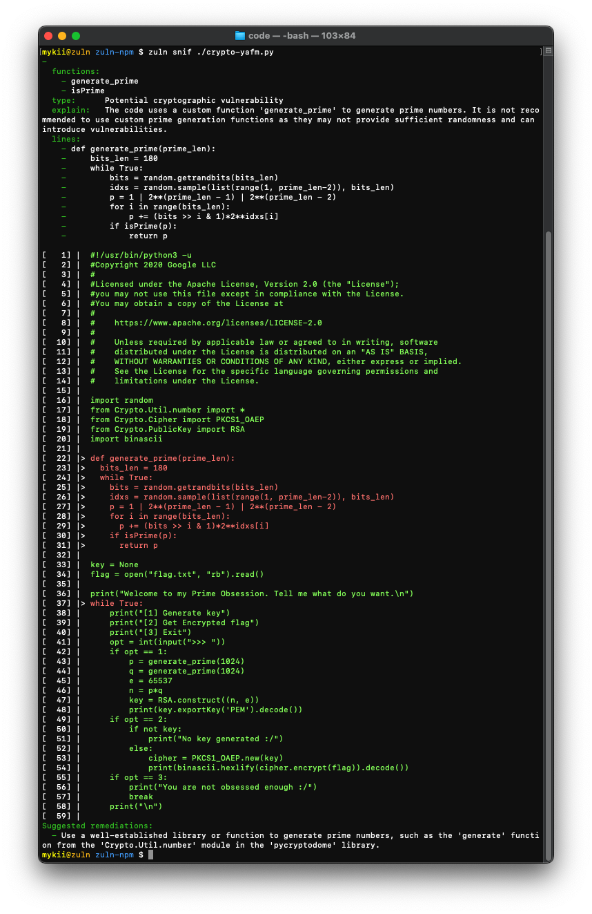
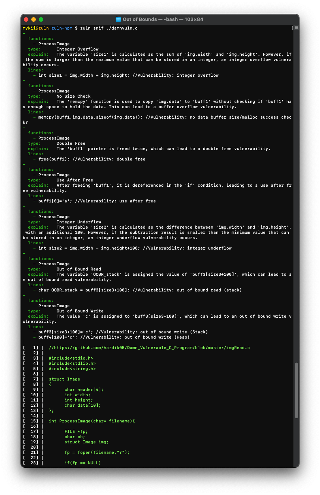
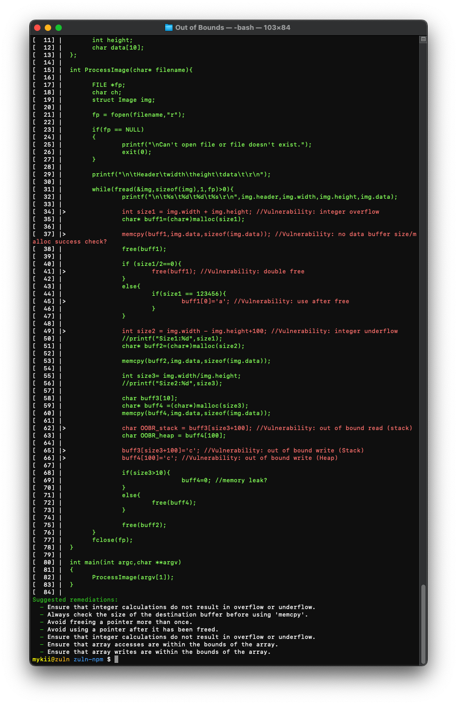

# Zuln - AI Vulnerability Hunter

Zuln is an AI-powered vulnerability hunter designed to assist in identifying security vulnerabilities in code. It leverages AI completion and Language Model Learning (LLM) techniques to analyze code and extract patterns indicative of vulnerabilities. This README provides installation instructions and demonstrates how to use Zuln for sniffing out specific types of vulnerabilities.

## Installation

To install Zuln, execute the following command:

```bash
npm install -g zuln
```

## Sniffing

Zuln's sniffing feature allows you to extract main patterns of vulnerable code using AI completion and LLM. It currently supports detecting vulnerabilities related to cryptographic issues and out-of-bounds errors. The following examples demonstrate how to use Zuln to identify these vulnerabilities.

### Cryptographic Vulnerability

To detect cryptographic vulnerabilities, use the provided `crypto-yafm.py` script. Below is an example of how to use Zuln for this purpose:

```bash
zuln snif ./crypto-yafm.py
```

```python
#!/usr/bin/python3 -u
#Copyright 2020 Google LLC
#
#Licensed under the Apache License, Version 2.0 (the "License");
#you may not use this file except in compliance with the License.
#You may obtain a copy of the License at
#
#    https://www.apache.org/licenses/LICENSE-2.0
#
#    Unless required by applicable law or agreed to in writing, software
#    distributed under the License is distributed on an "AS IS" BASIS,
#    WITHOUT WARRANTIES OR CONDITIONS OF ANY KIND, either express or implied.
#    See the License for the specific language governing permissions and
#    limitations under the License.

import random
from Crypto.Util.number import *
from Crypto.Cipher import PKCS1_OAEP
from Crypto.PublicKey import RSA
import binascii

def generate_prime(prime_len):
  bits_len = 180
  while True:
    bits = random.getrandbits(bits_len)
    idxs = random.sample(list(range(1, prime_len-2)), bits_len)
    p = 1 | 2**(prime_len - 1) | 2**(prime_len - 2)
    for i in range(bits_len):
      p += (bits >> i & 1)*2**idxs[i]
    if isPrime(p):
      return p

key = None
flag = open("flag.txt", "rb").read()

print("Welcome to my Prime Obsession. Tell me what do you want.\n")
while True:
    print("[1] Generate key")
    print("[2] Get Encrypted flag")
    print("[3] Exit")
    opt = int(input(">>> "))
    if opt == 1:
        p = generate_prime(1024)
        q = generate_prime(1024)
        e = 65537
        n = p*q
        key = RSA.construct((n, e))
        print(key.exportKey('PEM').decode())
    if opt == 2:
        if not key:
            print("No key generated :/")
        else:
            cipher = PKCS1_OAEP.new(key)
            print(binascii.hexlify(cipher.encrypt(flag)).decode())
    if opt == 3:
        print("You are not obsessed enough :/")
        break
    print("\n")
```




The output image demonstrates the vulnerable parts of the code and highlights potential security concerns.

### Out-of-Bounds Vulnerability

Zuln can also help identify out-of-bounds vulnerabilities. Use the provided `damnvuln.c` file to detect such issues. Here's an example command:

```bash
zuln snif ./damnvuln.c
```

```c
//https://github.com/hardik05/Damn_Vulnerable_C_Program/blob/master/imgRead.c

#include<stdio.h>
#include<stdlib.h>
#include<string.h>

struct Image
{
        char header[4];
        int width;
        int height;
        char data[10];
};

int ProcessImage(char* filename){

        FILE *fp;
        char ch;
        struct Image img;

        fp = fopen(filename,"r"); 

        if(fp == NULL)
        {
                printf("\nCan't open file or file doesn't exist.");
                exit(0);
        }

        printf("\n\tHeader\twidth\theight\tdata\t\r\n");

        while(fread(&img,sizeof(img),1,fp)>0){
                printf("\n\t%s\t%d\t%d\t%s\r\n",img.header,img.width,img.height,img.data);

                int size1 = img.width + img.height; //Vulnerability: integer overflow
                char* buff1=(char*)malloc(size1);

                memcpy(buff1,img.data,sizeof(img.data)); //Vulnerability: no data buffer size/malloc success check?
                free(buff1);

                if (size1/2==0){
                        free(buff1); //Vulnerability: double free
                }
                else{
                        if(size1 == 123456){
                                buff1[0]='a'; //Vulnerability: use after free
                        }
                }

                int size2 = img.width - img.height+100; //Vulnerability: integer underflow
                //printf("Size1:%d",size1);
                char* buff2=(char*)malloc(size2);

                memcpy(buff2,img.data,sizeof(img.data));

                int size3= img.width/img.height;
                //printf("Size2:%d",size3);

                char buff3[10];
                char* buff4 =(char*)malloc(size3);
                memcpy(buff4,img.data,sizeof(img.data));

                char OOBR_stack = buff3[size3+100]; //Vulnerability: out of bound read (stack)
                char OOBR_heap = buff4[100];

                buff3[size3+100]='c'; //Vulnerability: out of bound write (Stack)
                buff4[100]='c'; //Vulnerability: out of bound write (Heap)

                if(size3>10){
                                buff4=0; //memory leak?
                }
                else{
                        free(buff4);
                }

                free(buff2);
        }
        fclose(fp);
}

int main(int argc,char **argv)
{
        ProcessImage(argv[1]);
}
```





The images illustrate the identified vulnerabilities and provide explanations for each vulnerability discovered.

Feel free to leverage Zuln for vulnerability hunting and secure your code effectively!

## Contributing

Contributions to Zuln are welcome! If you discover any issues or have suggestions for improvements, please submit an issue or a pull request.